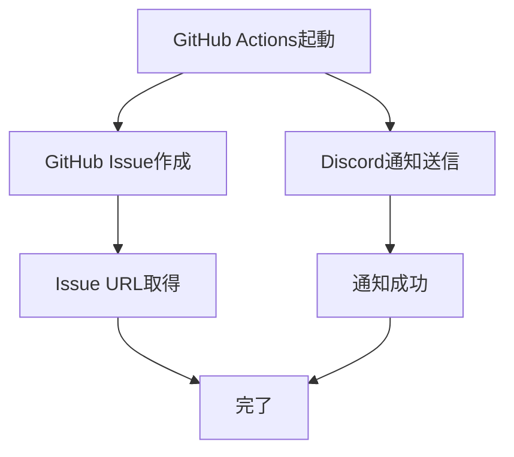

# 週次レビュー自動リマインダー セットアップガイド

毎週月曜10:00（JST）に自動的にリマインダーが送信されます。

---

## 📋 リマインダーの種類

1. **GitHub Issue自動作成** - 記録として残る
2. **Discord通知** - リアルタイム通知

---

## 🚀 セットアップ手順

### 1. Discord Webhook URL取得

#### ステップ1: Discord Serverでチャンネルを作成

```
1. Discordを開く
2. リマインダーを受け取りたいサーバーを選択
3. チャンネルを作成（例: #keiba-review-alerts）
```

#### ステップ2: Webhook URLを取得

```
1. チャンネル設定を開く（歯車アイコン）
2. 「連携サービス」→「ウェブフック」をクリック
3. 「新しいウェブフック」をクリック
4. 名前を設定（例: Weekly Review Bot）
5. アバターを設定（任意）
6. 「ウェブフックURLをコピー」をクリック
```

Webhook URLの形式：
```
https://discord.com/api/webhooks/1234567890/XXXXXXXXXXXXXXXXXXXXXXXXXXXXXXXXXXXXXXXXXXXXXXXXXXXXXXXXXX
```

### 2. GitHub Secretsに設定

#### ステップ1: GitHubリポジトリを開く

```
https://github.com/apol0510/keiba-review-monorepo
```

#### ステップ2: Secretsを追加

```
1. Settings > Secrets and variables > Actions
2. 「New repository secret」をクリック
3. Name: DISCORD_WEBHOOK_URL
4. Secret: （上記でコピーしたWebhook URL）
5. 「Add secret」をクリック
```

### 3. 動作確認（手動実行）

#### GitHub Actionsで手動実行

```
1. https://github.com/apol0510/keiba-review-monorepo/actions
2. 「Weekly Review Reminder」を選択
3. 「Run workflow」をクリック
4. 「Run workflow」を再度クリック
```

#### 確認項目

- ✅ GitHub Issueが作成されたか
- ✅ Discordに通知が届いたか

---

## 📅 自動実行スケジュール

- **頻度**: 毎週月曜
- **時刻**: 10:00 JST（01:00 UTC）
- **通知内容**:
  - GitHub Issue作成（記録用）
  - Discord通知（リマインダー）

---

## 📊 通知内容

### GitHub Issue

タイトル:
```
📊 週次レビュー（2026-01-08）
```

本文:
```markdown
## 📊 週次レビューの時間です

Claude Codeで以下を実行してください：

`週次レビュー`

---

## 📋 必要なデータ（GA4で確認）

### nankan-review
- 訪問者数（過去7日間）: ___人
- nankan-analyticsクリック: ___回
- オーガニック検索: ___%

### keiba-review-all
- 訪問者数（過去7日間）: ___人
- nankan-analyticsクリック: ___回
- オーガニック検索: ___%

（詳細なデータ確認方法も記載）
```

### Discord通知

Embedメッセージ:
```
📊 週次レビューの時間です

📅 日付: 2026-01-08 (Week 02)

🤖 Claude Codeで実行:
週次レビュー

📋 必要なデータ:
• 訪問者数（過去7日間）
• nankan-analyticsクリック数
• オーガニック検索の割合

🔗 リンク: GitHub Issue | GA4
```

---

## 🔄 実行フロー

### 毎週月曜10:00



### ユーザーの対応

```
1. Discord通知を受け取る
   ↓
2. GitHub Issueを開く
   ↓
3. GA4でデータを確認
   ↓
4. Claude Codeに「週次レビュー」と入力
   ↓
5. データを提供
   ↓
6. 分析結果を受け取る
   ↓
7. アクション項目を実行
   ↓
8. Issueにデータと結果を記録
   ↓
9. Issueをクローズ
```

---

## ⚙️ カスタマイズ

### スケジュール変更

`.github/workflows/weekly-review-reminder.yml` の `cron` を編集：

```yaml
on:
  schedule:
    # 毎週火曜 15:00 JST（06:00 UTC）に変更する例
    - cron: '0 6 * * 2'
```

**cron構文:**
```
分 時 日 月 曜日
0  1  *  *  1    # 毎週月曜 01:00 UTC（10:00 JST）
0  6  *  *  2    # 毎週火曜 06:00 UTC（15:00 JST）
```

**曜日:**
- 0 = 日曜
- 1 = 月曜
- 2 = 火曜
- ...

### Discord通知の色変更

`.github/workflows/weekly-review-reminder.yml` の `color` を編集：

```json
"color": 3447003  // 青色
"color": 15258703 // オレンジ色
"color": 3066993  // 緑色
"color": 15158332 // 赤色
```

---

## 🐛 トラブルシューティング

### Discord通知が届かない

**確認項目:**
1. `DISCORD_WEBHOOK_URL` がGitHub Secretsに設定されているか
2. Webhook URLが正しいか（`https://discord.com/api/webhooks/...`）
3. Discordチャンネルが削除されていないか
4. GitHub Actionsのログを確認

**確認方法:**
```
1. https://github.com/apol0510/keiba-review-monorepo/actions
2. 最新の「Weekly Review Reminder」をクリック
3. 「send-reminder」ジョブのログを確認
```

### GitHub Issueが作成されない

**確認項目:**
1. GitHub Actionsの権限が有効か
2. リポジトリの設定でIssue機能が有効か

**確認方法:**
```
Settings > Actions > General > Workflow permissions
「Read and write permissions」が選択されているか確認
```

### 手動実行で即座にテスト

```
1. https://github.com/apol0510/keiba-review-monorepo/actions
2. 「Weekly Review Reminder」を選択
3. 「Run workflow」をクリック
4. Discordとメールを確認
```

---

## 📈 運用Tips

### Issueラベルの活用

自動作成されたIssueには以下のラベルが付きます：
- `weekly-review` - 週次レビュー
- `automated` - 自動作成
- `analytics` - アナリティクス関連

フィルタ例：
```
https://github.com/apol0510/keiba-review-monorepo/issues?q=is:issue+label:weekly-review
```

### 過去の記録を振り返る

```
1. Issues > Filters
2. is:closed label:weekly-review
3. 過去の週次レビューを時系列で確認
```

### Discord通知のミュート

一時的に通知を止めたい場合：
```
1. Discordチャンネル設定
2. 「通知設定」
3. 「このチャンネルをミュート」
```

---

## 🔗 関連リンク

- [GitHub Actions: weekly-review-reminder.yml](https://github.com/apol0510/keiba-review-monorepo/blob/main/.github/workflows/weekly-review-reminder.yml)
- [MONTH-1-SETUP-GUIDE.md](./MONTH-1-SETUP-GUIDE.md)
- [WEEKLY-REVIEW-CHECKLIST.md](./WEEKLY-REVIEW-CHECKLIST.md)
- [GA4-GROWTH-ROADMAP.md](./GA4-GROWTH-ROADMAP.md)

---

**最終更新:** 2026-01-01
**次回実行予定:** 毎週月曜 10:00 JST
